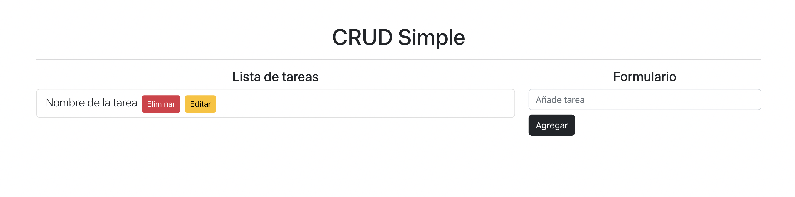
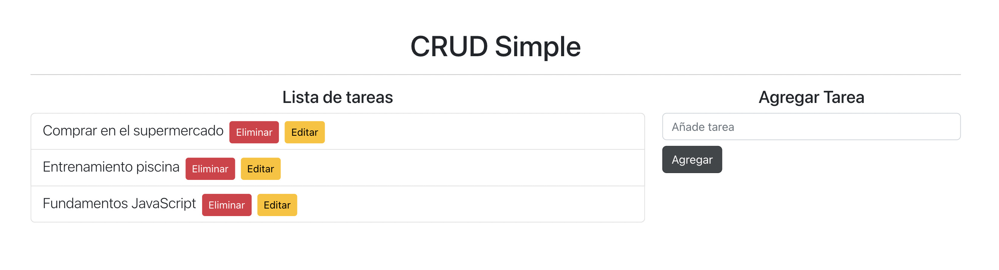

# CRUD Simple Ûdemy

Proyecto para poner en práctica conocimientos de REACT & Bootstrap 5

## `Creando los botones`

En la etiqueta formulario añadimos los botones con la className para Bootstrap

## `ID aleatorios`

Instalando en la terminal npm i nanoid para generar números aleatorios de identificadores únicos dentro del array de objetos.

## `Agregar tarea`

