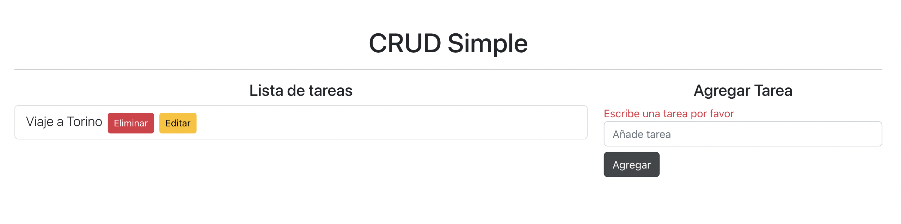

# CRUD Simple Ûdemy

Proyecto para poner en práctica conocimientos de REACT & Bootstrap 5

## ▶️ `Creando los botones`

En la etiqueta formulario añadimos los botones con la className para Bootstrap

## 🔖 `ID aleatorios`

Instalando en la terminal npm i nanoid para generar números aleatorios de identificadores únicos dentro del array de objetos.

## 📝 `Agregar tarea`

## 📌 `Mensaje de error`

Le pedimos al usuario que añada una nueva tarea, siempre que el input esté vacío.

👇🏻 Aquí puedes probar la app 👇🏻

[Crud app](https://strong-selkie-a975ce.netlify.app/)